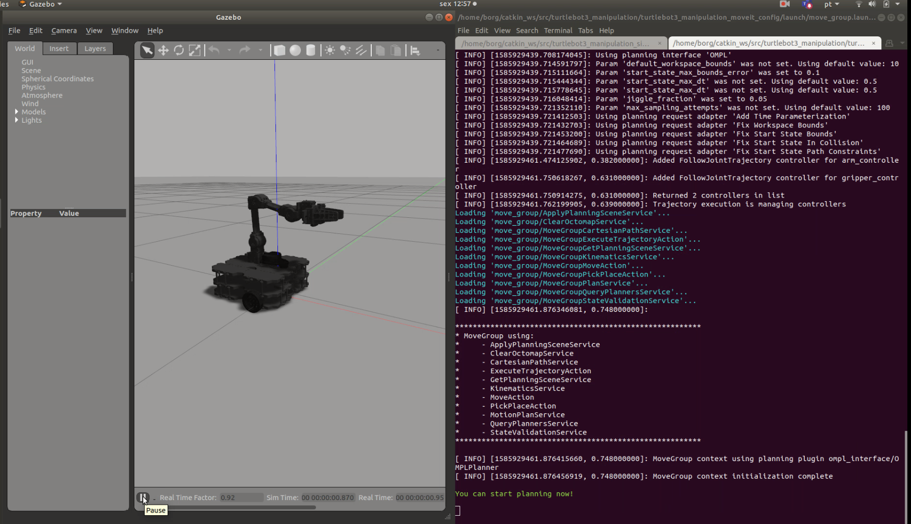

# Open Manipulator com Turtlebot3

Este é um guia para instalação e configuração do Open Manipulator com Turtlebot3 Waffle
preparamos um Script que executa a instalação de forma automatica, execute com os comandos a seguir:

Abra um terminal Crtl+Alt+t digite:

    roscd my_simulation
    
Atualize o Repositório

    git pull

Vá até a pasta "garra"
    
    cd garra

Conceda permissão de execução para o script;

    chmod a+x instala_garra.sh

Execute o script
    
    ./instala_garra.sh
  

### Testando!!

Abra um novo terminal Crtl+Alt+t digite:

    roslaunch turtlebot3_manipulation_gazebo turtlebot3_manipulation.launch
    
Em um outro terminal Crtl+Shift+t:

    roslaunch turtlebot3_manipulation_moveit_config move_group.launch
    
Aperte o "play" no Gazebo para liberar a simulação

 
 
    
Em um outro terminal Crtl+Shift+t

    roslaunch turtlebot3_manipulation_moveit_config moveit_rviz.launch
    
    
    
 Controle o OpenManipulator:
 
 
 
 

    
