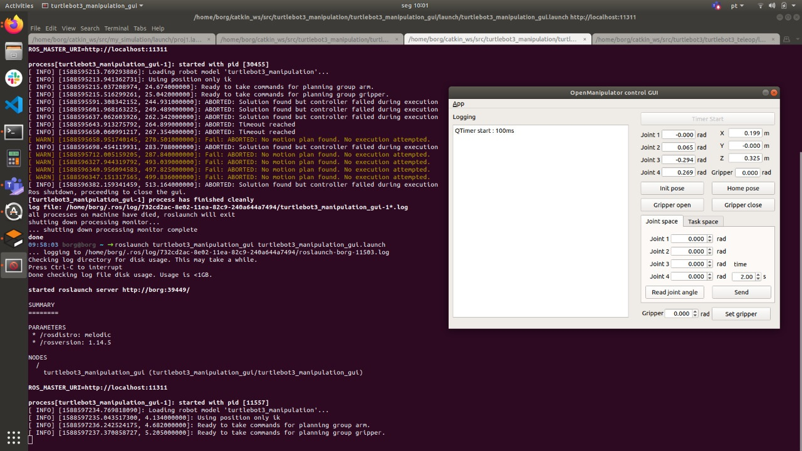
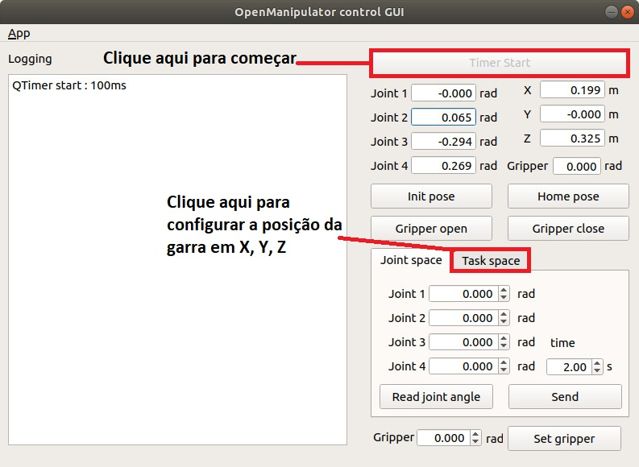
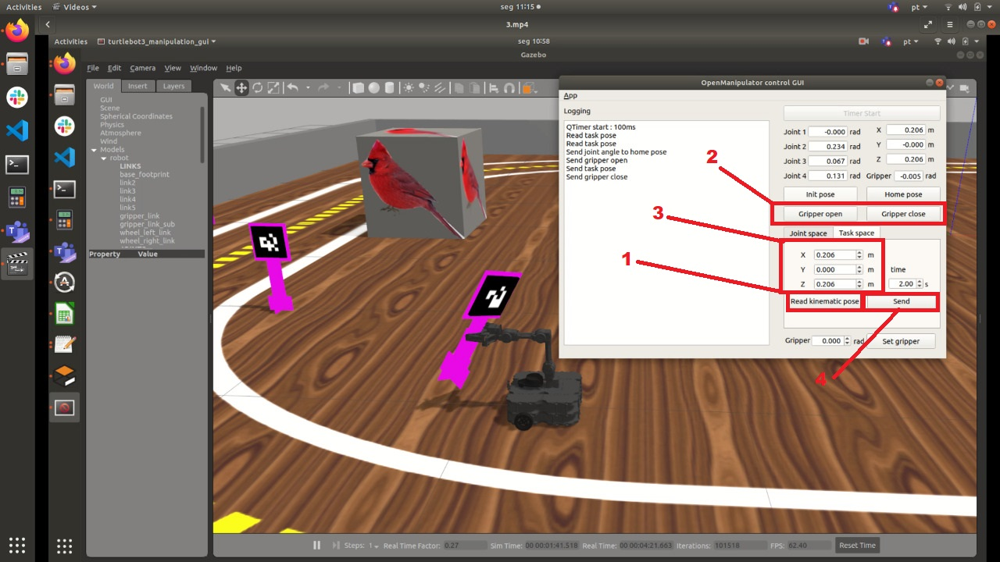
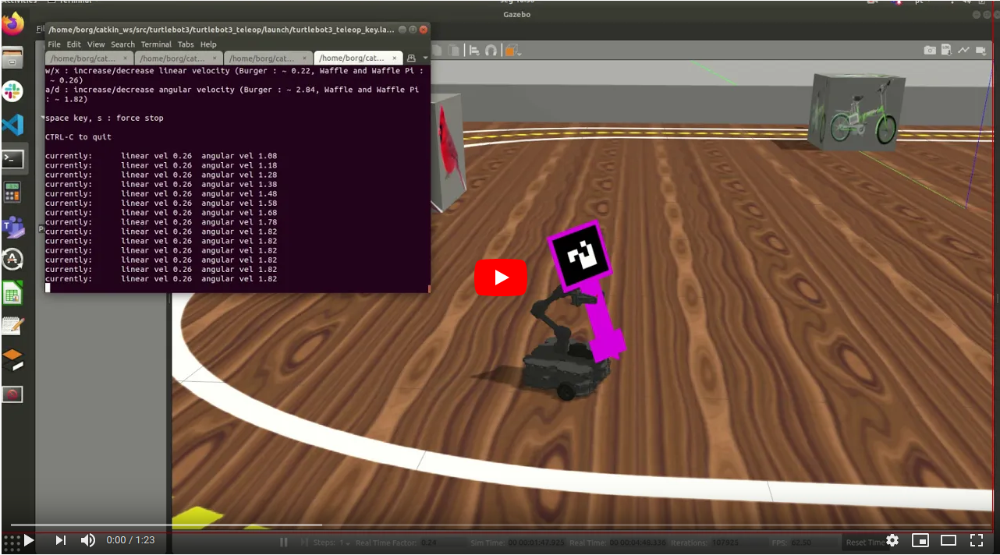
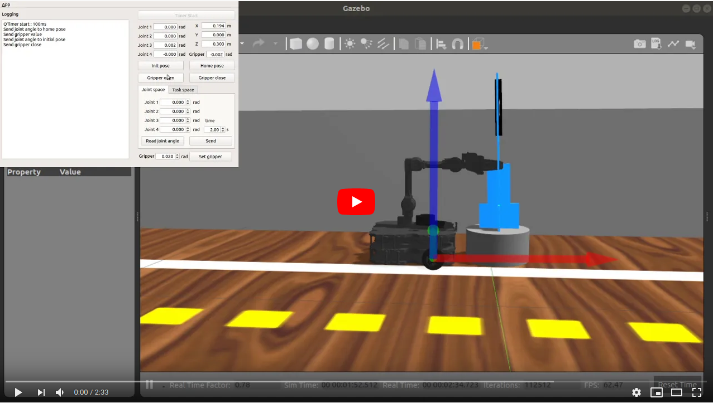

# Interface de controle - Open Manipulator 

Este é um guia para  Interface de controle do Open Manipulator com Turtlebot3 Waffle

### Antes de qualquer coisa, vamos atualizar o repositório

Abra um terminal Crtl+Alt+t digite:

    roscd my_simulation
    
Atualize o Repositório

    git pull

### Agora vamos rodar os launchs necessários

Abra um novo terminal Crtl+Alt+t e escolha um dos mapas disponiveis para usar:

    roslaunch my_simulation proj1.launch 
    
    roslaunch my_simulation proj1_estreita.launch 
    
    roslaunch my_simulation proj1_base.launch
    
    
Em um outro terminal Crtl+Shift+t:

    roslaunch turtlebot3_manipulation_moveit_config move_group.launch
    
Aperte o "play" no Gazebo para liberar a simulação

 
 
    
Em um outro terminal Crtl+Shift+t abra a interface de controle;

    roslaunch turtlebot3_manipulation_gui turtlebot3_manipulation_gui.launch
  
  
 ## O resultado deve ser parecido com isso 
  
 
 
 
 
 - Clique em Timer Start 
 - Clique em Task space para configurar as posições X,Y e Z da garra
  
  
 
 - Clique em "Read Kinematic pose" para atualizar as posições nos eixos
 - Clique no botão "Gripper open" para abrir ou "Gripper close" para fechar a garra
 - Altere os valores de X,Y e Z para configurar as novas posições 
 - Clique em "Send" para enviar os comandos para o robô no Gazebo
 
   

## Demonstração em video 

 

    
    
    
    
    
 

